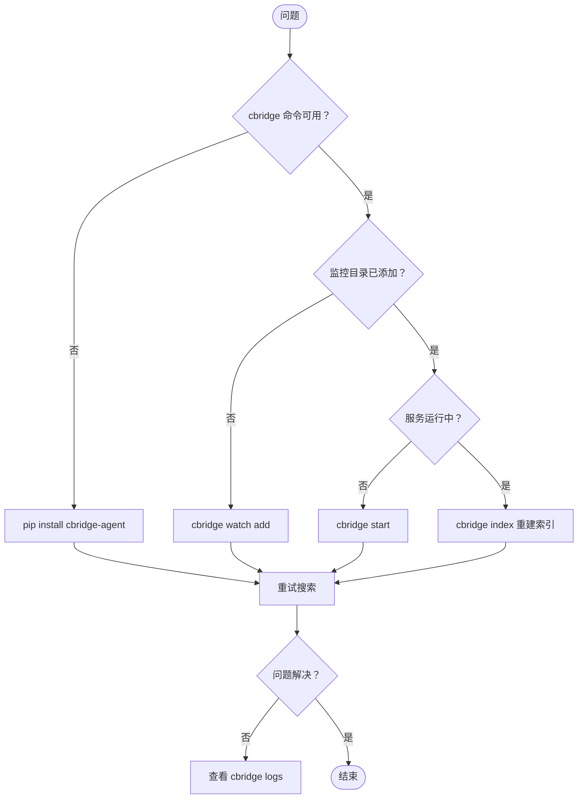

# 故障排查手册

---

## 常见问题

### 1. `cbridge` 命令未找到

**原因**: 未安装或 PATH 未配置

**解决**:
```bash
pip install cbridge-agent
# 或更新
pip install --upgrade cbridge-agent
```

### 2. 搜索结果为空

**可能原因**:
- 监控目录未添加
- 索引未构建完成
- 关键词不匹配

**解决**:
```bash
# 检查监控目录
cbridge watch list

# 添加目录（如为空）
cbridge watch add /path/to/documents

# 强制重建索引
cbridge index

# 扩大关键词范围重试
cbridge search <更宽泛的关键词>
```

### 3. 服务无法启动

**检查**:
```bash
cbridge status
cbridge logs
```

**常见错误**:
- 端口冲突 → 修改配置或停止占用进程
- 权限问题 → 检查目录读写权限

### 4. 索引更新延迟

**原因**: 文件监控服务未运行

**解决**:
```bash
cbridge start
# 或手动重建
cbridge index
```

---

## 诊断流程



---

## 获取帮助

```bash
cbridge --help
```

或访问 GitHub Issues: <https://github.com/whyischen/context-bridge/issues>
